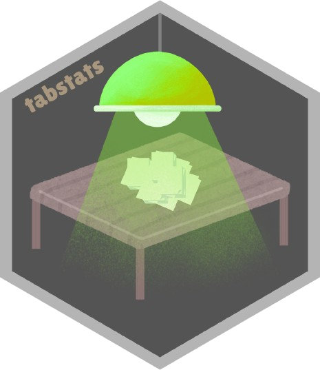

```{r, include = FALSE}
knitr::opts_chunk$set(
    collapse = TRUE,
    comment = "#>",
    fig.path = "man/figures/README-",
    out.width = "100%",
    message = FALSE,
    warning = FALSE
)

desc = read.dcf("DESCRIPTION")
desc = setNames(as.list(desc), colnames(desc))
library(tabstats)
```

# `r desc$Package` 

[](https://CRAN.R-project.org/package=tabstats)
[](https://github.com/joshuamarie/tabstats/actions/workflows/R-CMD-check.yaml)

## Package overview

Title: ***`r desc$Title`***

***`r desc$Package`*** is a lightweight package in action, ideal for development, that allows end users to print out the data they want to present as a table in the command line, with further enhancements that modify the table with styles and alignment. This is very useful when displaying statistical results on the R console/command line as a table.

## Installation

Install the following package from CRAN:

```{r, eval = FALSE}
install.packages("tabstats")
```

Or install the development version from GitHub:

``` r
# install.packages("pak")
pak::pak("joshuamarie/tabstats")
## devtools::install_github("joshuamarie/tabstats") 
```

## Example

Here’s a basic example that demonstrates how to use `tabstats` to format and style a table:

```{r}
table_default(head(mtcars, 5))
```

This package allows end users to apply advanced styling and alignment to tables, such as color coding, column alignment, and borders. 

## License

`r desc$License`

## Code of Conduct

Please note that the `tabstats` project is released with a [Contributor Code of Conduct](https://contributor-covenant.org/version/2/1/CODE_OF_CONDUCT.html). By contributing to this project, you agree to abide by its terms.
